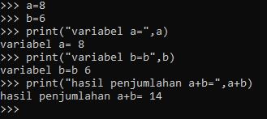

# latihan1
### menjalankan python console
#### menampilkan tulisan "hello"
#### menampilkan tulisan "saya sedang belajar python"dilayar

# latihan2

# latihan 3
### menjalankan idle
#### membuat file baru dengan nama latihan3.py
#### menggunkan fungsi input untuk mengambil nilai variabel
